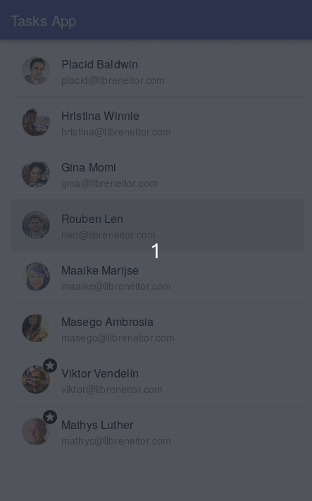

# React & Django task list

You can run this app locally by just typing `make` in your console. The only requirement is to have Docker and Docker Compose installed. After the `make` command finished, you can go to `http://localhost:80` to test it.

## Original exercise features
Develop a task management system:

* Each task should have its own status, description, and users assigned to it. 
* Statuses:  new, in progress, completed, archived.
* The system should provide the user roles. Only the administrator should be able to archive tasks.
* Users assigned to tasks receive notifications about changes by email.
* Users should be able to comment on the tasks. Only administrators can delete comments.
* Don’t forget about the tests. This should be a stripped version with only the necessary aspects.

## What wasn't done

* There is no real login, I didn't want to make necessary to use user/password to test such a simple app.
* `archived` state is only "enforced" in the frontend.
* A ton a real validation, is just an exercise I didn't want to invest much time.
* Send emails: It's overkill and complex to send emails correctly, but for an exercise I would be just fine by making an SMTP call, but you wouldn't be able to test it anyway.
* Frontend comments: at least, the backend logic for the comments is done.
